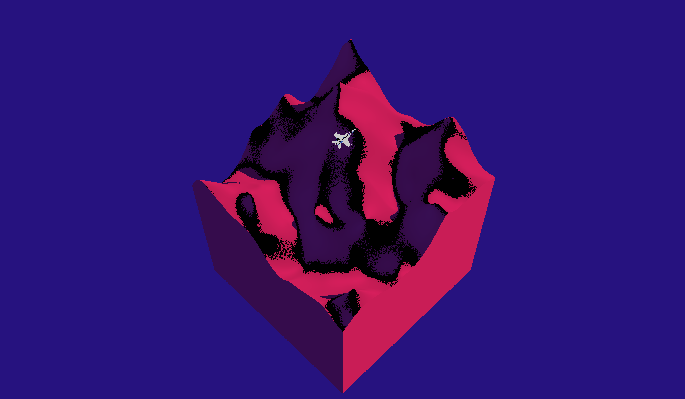

# Jet Loop

This is a WIP project aimed at familiarizing myself with OpenGL and graphics APIs in general.

Currently the jet model is animated flying over a simple scrolling terrain. The terrain is generated via the Fractal Brownian Motion and eroded based on the height gradients. 

## Instructions
*to run the solution, please download the [assimp library](https://github.com/assimp/assimp/blob/master/Build.md) and put it into the root/code/external folder so that the path to the assimp's top CMakeLists.txt looks like root/code/external/assimp/CMakeLists.txt*

*to run the build, pull the root/out/build/code/application/Debug folder and run the OpenGLApp executable*
